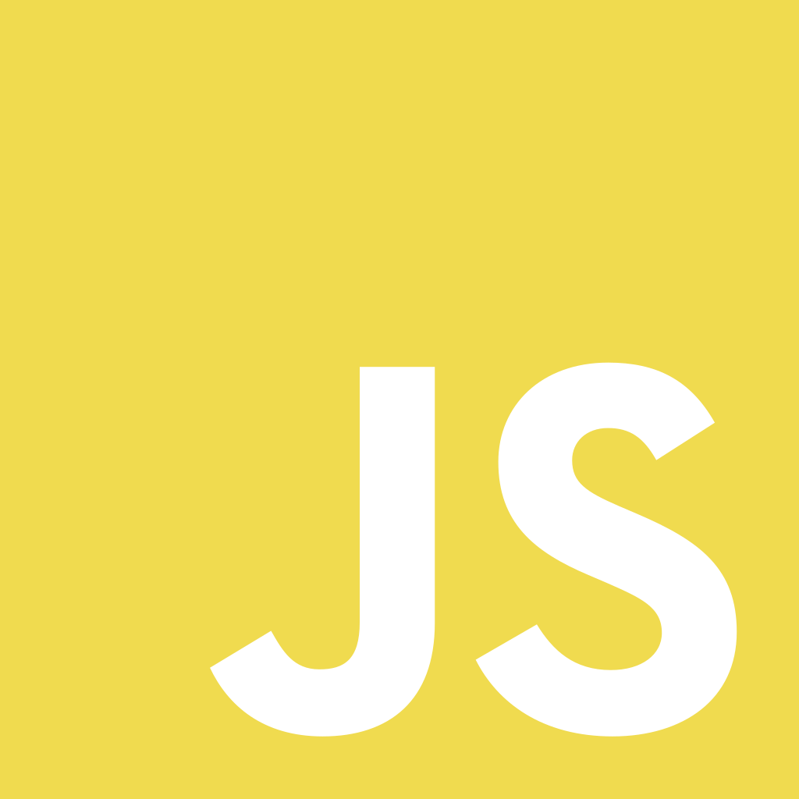

  

<h4 align="center" style="margin-top: 32px">
  <a href="https://kuhlti.me">Website</a>
  &bull;
  <a href="https://twitter.com/KuhlTime">Twitter</a>
  &bull;
  <a href="https://linkedin.com/in/KuhlTime">LinkedIn</a>
  &bull;
  <a href="https://stackoverflow.com/users/story/4179020">StackOverflow</a>
</h4>

 

Hi, my name is André. I am 23yo and I love programming. 

I am an electrical engineering / information technology student at [HSD](https://hs-duesseldorf.de). 

More about me:
- 🌏 Living in: Langenfeld, Germany 🇩🇪 🇪🇺
- 🔭 I’m currently working on: 
  - Full-Stack, Dev-Ops [@dfind](https://dfind.com)
- 🌱 I’m currently learning: 
  - AWS 
  - Electrical Engineering 💥 
- 💬 Ask me about: 
  - JavaScript 
  - NodeJS 
  - Python 
  - Swift 
  - TypeScript 
  - VueJS 
- 🎧 Listening to: 
  - <a href="https://music.youtube.com/playlist?list=OLAK5uy_ksNRf9stkH3wG5UBSpOheZ6UxX-K02F-c" target="_blank">ODESZA </a>
- 🤩 Interested in:
  - Formula 1
  - Mountain Biking
