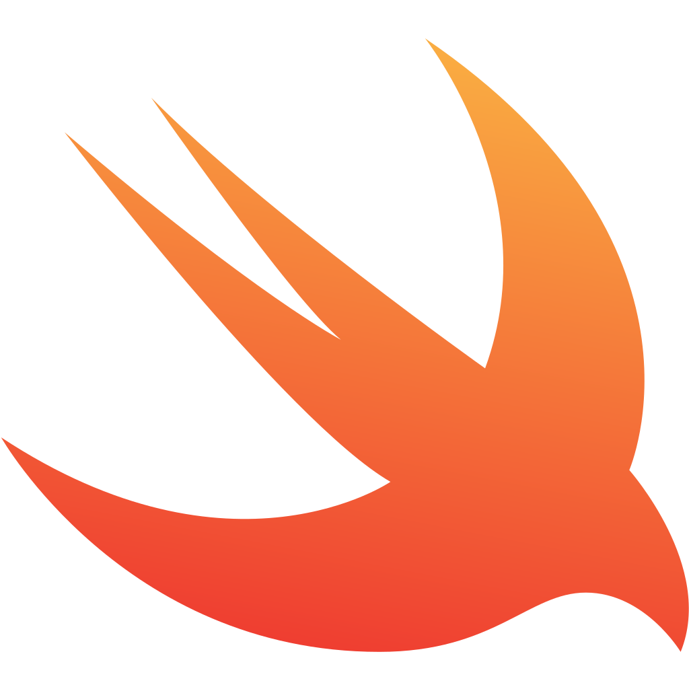
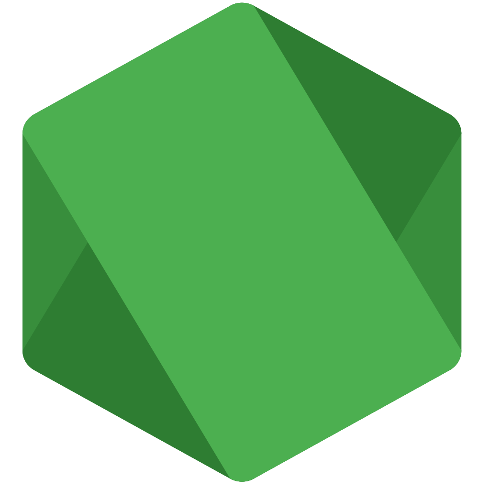
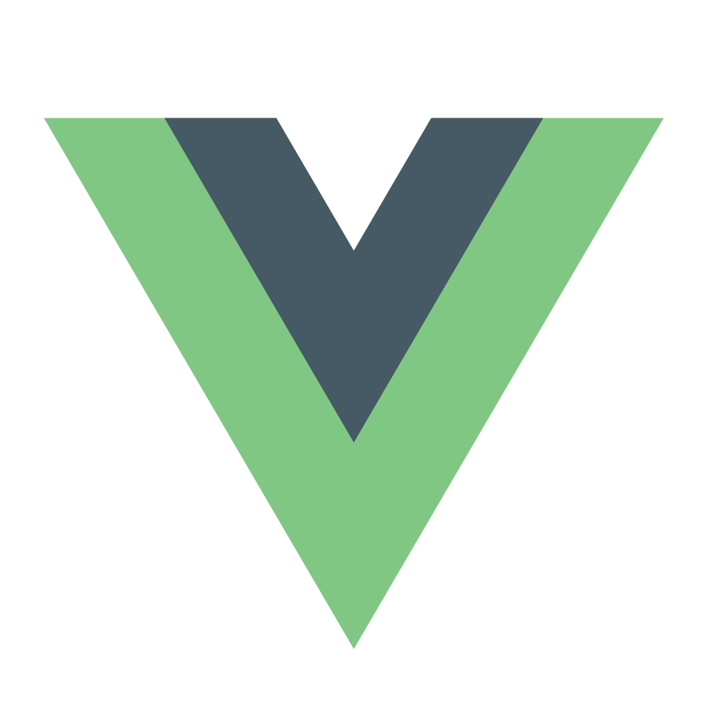
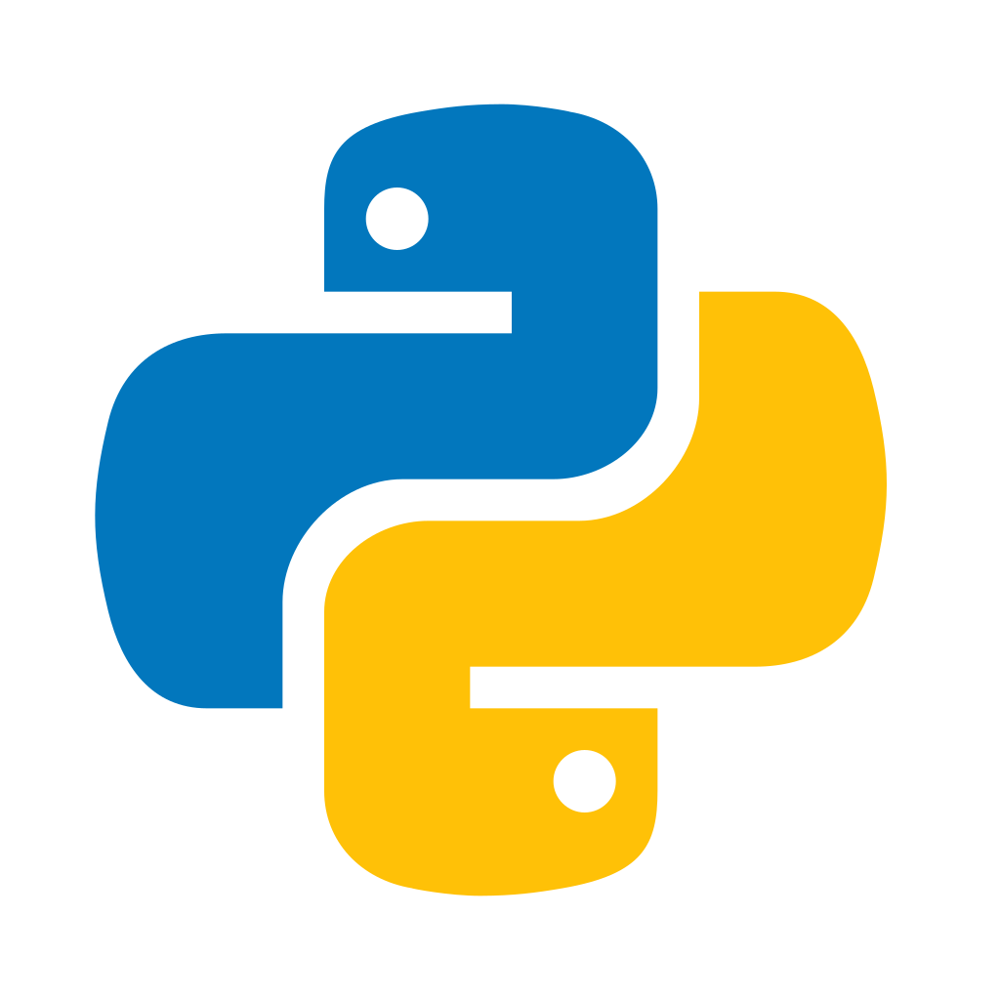

<h1 align="center">Hi, I'm André 👋</h1>

I'm a <code>Student</code>, <code>Developer</code> and <code>Engineer</code>.

<h4 align="center" style="margin-top: 32px">
  <a href="https://kuhlti.me">Website</a>
  &bull;
  <a href="https://twitter.com/KuhlTime">Twitter</a>
  &bull;
  <a href="https://linkedin.com/in/KuhlTime">LinkedIn</a>
  &bull;
  <a href="https://stackoverflow.com/users/story/4179020">StackOverflow</a>
</h4>

<table><tr><td valign="top" width="50%">

**About Me**

<ul>
  <li>
   ✨ Born in 1998 (23yo)
	</li>
  <li>
    🌍 🇩🇪 Living in Langenfeld, Germany (near Düsseldorf / Cologne)
	</li>
  <li>
   🚲 🏎 Interested in Mountainbiking, Formula 1, Sports and Nerd Talk
	</li>
</ul>
	
</td>
<td valign="top" width="50%" rowspan="2">

**Skills**
	
<ul>
  <li>
    
		<a href="https://apple.com/swift/" target="_blank">swift</a> - A robust and intuitive programming language created by Apple for building apps for iOS, Mac, Apple TV, and Apple Watch.
	</li>
  <li>
    
		<a href="https://typescriptlang.org/" target="_blank">typescript</a> - A strongly typed programming language which builds on JavaScript giving you better tooling at any scale.
	</li>
  <li>
    
		<a href="https://nodejs.org" target="_blank">nodejs</a> - A JavaScript runtime built on Chrome's V8 JavaScript engine.
	</li>
	<li>
    
		<a href="https://github.com/vuejs" target="_blank">vuejs</a> - A progressive, incrementally-adoptable JavaScript framework for building UI on the web. 
	</li>
  <li>
    
		<a href="https://python.org/" target="_blank">python</a> - An interpreted, object-oriented, high-level programming language with dynamic semantics.
	</li>
</ul>

</td></tr><tr><td valign="top" width="50%">

**Work**
<ul>
	<li>
    
    - Student for Electrical Engineering and Information Technology.
	</li>
	<li>
    
    - Student Assistantant (Software Engineering, Embedded Systems and Operating Systems).
	</li>
  <li>
    
    <a href="https://dfind.com" target="_blank">dfind</a> - Full-Stack, DevOps Working Student. Responsible for the development of a nodejs backend hosted on AWS. 
	</li>
</ul>

</td></tr></table>
