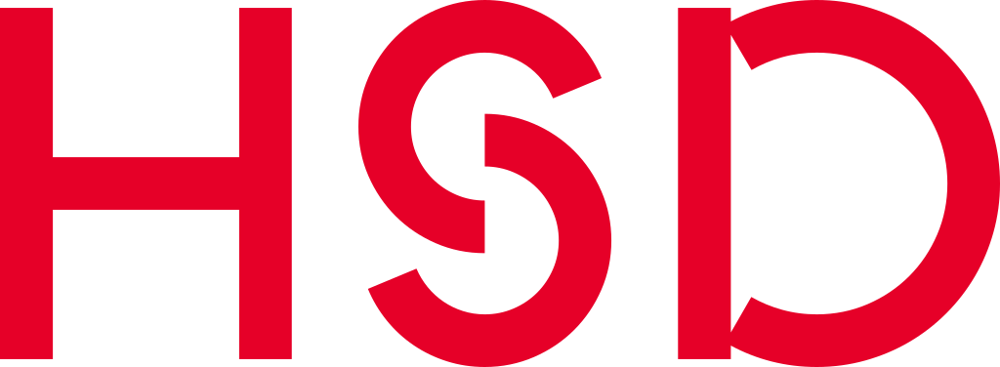

<h1 align="center">Hi, I'm André 👋</h1>

I'm a passionate <code>Developer</code> and <code>Engineer</code>.

<h4 align="center" style="margin-top: 32px">
   <a href="https://kuhlti.me">Website</a>
   &bull;
   <a href="https://twitter.com/KuhlTime">Twitter</a>
   &bull;
   <a href="https://linkedin.com/in/KuhlTime">LinkedIn</a>
   &bull;
   <a href="https://stackoverflow.com/users/story/4179020">StackOverflow</a>
</h4>
<table>
   <tr>
      <td valign="top" width="50%">
         <b>About Me</b>
         <ul>
            <li>
               ✨ Born in 1998 (25yo)
            </li>
            <li>
               🌍 🇩🇪 Living in Langenfeld, Germany (near Düsseldorf / Cologne)
            </li>
            <li>
               🌳 🏎 🎹 🍳 Interested in Nature, Formula 1, Piano playing, Sports and Nerdism
            </li>
            <li>
               ❤️ Listening to <a href="https://www.youtube.com/watch?v=Z9XwSGS-A6I">ODESZA</a>, <a href="https://open.spotify.com/show/2MAi0BvDc6GTFvKFPXnkCL">Lex Fridman</a> and <a href="https://www.youtube.com/c/fireship">Jeff Delaney</a> aka Fireship.
            </li>
         </ul>
      </td>
      <td valign="top" width="50%" rowspan="2">
         <b>Skills</b>
         <ul>
            <li>
               
               <a href="https://apple.com/swift/" target="_blank">swift</a> - A robust and intuitive programming language created by Apple for building apps for iOS, Mac, Apple TV, and Apple Watch.
            </li>
            <li>
               
               <a href="https://typescriptlang.org/" target="_blank">typescript</a> - A strongly typed programming language which builds on JavaScript giving you better tooling at any scale.
            </li>
            <li>
               
               <a href="https://nodejs.org" target="_blank">nodejs</a> - A JavaScript runtime built on Chrome's V8 JavaScript engine.
            </li>
            <li>
               
               <a href="https://github.com/vuejs" target="_blank">vuejs</a> - A progressive, incrementally-adoptable JavaScript framework for building UI on the web. 
            </li>
            <li>
               
               <a href="https://python.org/" target="_blank">python</a> - An interpreted, object-oriented, high-level programming language with dynamic semantics.
            </li>
            <li>
               
               <a href="https://arduino.org/" target="_blank">arduino</a> / embedded - Familiar with the development of embedded devices on ARM processors, ESP32s and Raspberry PIs.
            </li>
         </ul>
      </td>
   </tr>
   <tr>
      <td valign="top" width="50%">
         <b>Education</b>
         <ul>
            <li>
               
               - B. Eng. in Electrical Engineering and Information Technology. With a specialization in Computer Sciences. Grade: 1.9 (2017-2022)
            </li>
            <li>
               
               - Award for the best <a href="https://github.com/KuhlTime/bachelors-thesis">bachelor's thesis</a> in the year 2022 given out by the VDE Düsseldorf
            </li>
         </ul>
         <b>Work</b>
         <ul>
            <li>
               
               <a href="https://hs-duesseldorf.de" target="_blank">University of Applied Sciences</a>
               - Teaching Assistant (Software Engineering, Embedded Systems and Operating Systems). (2020-2022)
            </li>
            <li>
               
               <a href="https://dfind.com" target="_blank">dfind</a> / 
               
               <a href="https://emmysoft.com" target="_blank">EmmySoft</a>
               - Full-Stack, DevOps Working Student. Responsible for developing a wide variaty of applications.   (2021-2022)
            </li>
            <li>
               
               <a href="https://emmysoft.com" target="_blank">EmmySoft</a>
               - Software Engineer. Creating all sorts of wonderful software products.   (2022-today)
            </li>
         </ul>
      </td>
   </tr>
</table>
